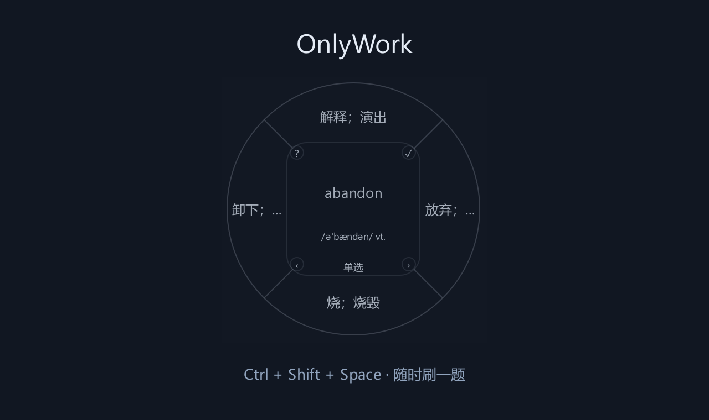
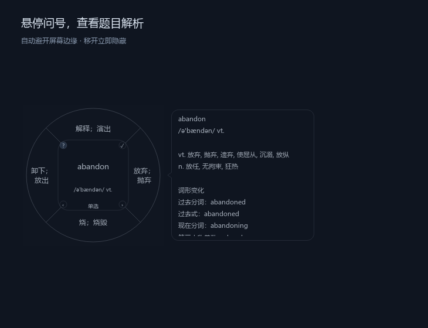
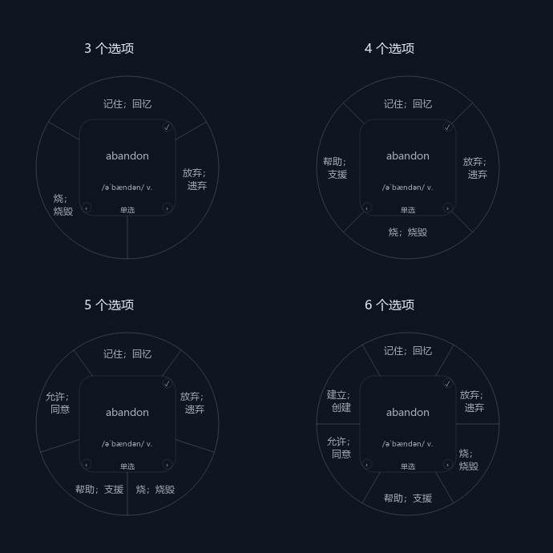

# OnlyWork

[](https://github.com/S20010831/OnlyWork/actions/workflows/ci.yml)
[](LICENSE)

Windows 常驻的轻量径向刷题工具。通过快捷键或托盘，在鼠标附近唤出透明圆盘；支持单选、多选、Excel / JSON 题库、复习调度和扩展动作。



## 下载与使用

Windows 10 / 11 用户可从 [Releases](https://github.com/S20010831/OnlyWork/releases) 下载 Windows x64 便携版。
完整解压到可写目录，运行 `OnlyWork.exe`；程序启动后驻留托盘，按 **Ctrl + Shift + Space** 唤出圆盘。

右键托盘 → **设置 / 导入题库** → 选择随包附带的 `examples/cet4-vocabulary.xlsx`，即可导入 **3,848 词**的四级练习题库。
也可单独下载 [Excel 示例](examples/cet4-vocabulary.xlsx)。词库范围、来源、校正与许可见 [示例说明](examples/README.md)。

## 从源码启动

需要 Windows 与 Python 3.12 或 3.13。已有虚拟环境时：

```powershell
.venv\Scripts\python.exe -m pip install -r requirements.txt
.venv\Scripts\python.exe main.py
```

新环境：

```powershell
py -3.12 -m venv .venv
.venv\Scripts\python.exe -m pip install -r requirements.txt
.venv\Scripts\python.exe main.py
```

程序启动后驻留托盘，不会立即显示圆盘。按 **Ctrl + Shift + Space** 或右键托盘 → **显示径向界面**。托盘提供设置、导入题库和退出；使用单实例锁避免重复启动。快捷键被占用时会提示，可继续使用托盘。

当前桌面交互面向 Windows，使用全局快捷键或托盘菜单唤出界面。

## 刷题交互

- 每题 3～6 个选项，从顶部开始顺时针分布。
- 单选点击后立即判断；点击另一选项会替换原选择。
- 多选点击切换选择，再点击右上角 **✓** 确认；空选择不计入答题记录。
- 答错保留当前题，可修改选择后重试；同一次选择的重复确认不会重复计数。
- 答对后默认 650ms 自动切题；点击上一题 / 下一题会取消等待并重置答题状态。
- 鼠标停在左上角 **?** 时显示轻量解析气泡，移开立即隐藏；气泡沿用圆盘的透明度、文字和细线颜色，没有标题栏和阴影，按内容高度展开。自动选择屏幕空余方向，在问号上滚轮可翻阅长解析。
- 网页和音频扩展通过点击 **?** 执行；没有扩展时隐藏该按钮。
- 选项按扇区空间自动换行，优先在分号、逗号处分行；最多显示四行，仅最后一行放不下时省略。仍显示不完整的选项在悬停时展示透明全文气泡，在该选项上滚轮可翻阅，移开隐藏。
- 鼠标进入圆盘后再离开，会渐隐；渐隐期间移回可取消隐藏。





## 导入题库

右键托盘 → **设置 / 导入题库** → **导入题库**。支持 `.xlsx` 和 `.json`。导入成功立即生效，并保存到本地缓存；重启自动恢复。导入失败保留当前题库。格式问题集中显示在可滚动的报告中，包含行号、重复 ID、无效答案和选项数量等错误。
设置中可点击 **保存空白模板**，另存并填写后导入；也可下载 [空白模板](examples/question-template.xlsx)。

### Excel

题库工作表首行是表头，必需列可任意排序；空行忽略，格式错误会报告行号。
当前选中的工作表含题库表头时优先读取它；否则自动识别唯一的题库工作表。

| 列 | 格式 |
|---|---|
| ID | 可选，1、2、3 等不重复的固定正整数序号 |
| 题目 | 必需，首行是正文；在 Excel 中按 Alt + Enter 换行，后续行显示为较小的提示文字 |
| A、B、C | 必需列，每列直接填写一个选项的内容 |
| D、E、F | 可选列，不使用时留空或删除；每题共填写 3～6 个选项 |
| 正确选项 | 必需，单选 `B`，多选 `A|C` |
| 扩展 | 可选，`info:解析`、`url:https://example.com`、`audio:音频路径` |

正确选项只有一个时为单选，有多个时为多选，无需填写题型。题目可以写成 `abandon`，在同一单元格换行后填写 `/əˈbændən/ v.`。

相对音频路径以题库文件所在目录为基准。导入时音频复制到应用的 `data/assets/`，因此移动或删除原题库、原音频后仍可使用。链接动作支持 http / https；音频播放使用 Qt Multimedia，并显示播放错误。

建议为长期维护的题库填写 ID。示例使用固定序号 1～3848；排序时必须随整行保留 ID，不要重新编号，新增题目使用未占用的新编号。不填写时自动根据题目、选项和答案生成内容 ID；调整题目行顺序或选项显示顺序不会改变 ID，修改题目或答案会视为新题。解析和扩展动作的修改不会重置进度。

### JSON

可使用题目数组，也可使用 `{"version": 1, "questions": [...]}`。完整示例见 [examples/questions.json](examples/questions.json)。

```json
{
  "id": "vocabulary-abandon",
  "prompt": "abandon\n/əˈbændən/ v.",
  "options": [
    {"id": "A", "text": "放弃；遗弃"},
    {"id": "B", "text": "记住；回忆"},
    {"id": "C", "text": "逃跑；逃脱"}
  ],
  "correct_ids": ["A"],
  "extension": {"type": "info", "value": "abandon 表示放弃或遗弃。"}
}
```

## 设置、数据与复习

设置窗口中的颜色、答对后切题时间和离开隐藏延迟立即生效并保存。颜色支持透明度；悬停色、选中色、中心背景色分别用于对应区域。

源码版数据位于项目的 `data/`；便携版位于 `OnlyWork.exe` 同目录的 `data/`：

- `library.json`：版本化题库缓存。
- `assets/`：导入的音频文件。
- `settings.json`：主题与交互参数；也包含 `cursor_arm_delay_ms`、`fade_duration_ms`。
- `review_state.json`：答题次数、正确率、连续正确次数、复习时间和各题库的学习位置。

数据文件通过临时文件和原子替换保存；非法配置字段使用默认值，其他有效字段保留。
学习记录按题库隔离：同一路径的文件重复导入保留进度；不同文件中的相同 ID 分别记录。改名或移动源题库后重新导入会作为新题库；重启时使用缓存中的题库标识，删除源文件不会影响已有缓存和进度。
切题和答题时立即保存学习位置，重启继续当前未完成的题；答对后尚未自动切题就退出，重启会选择下一道推荐题，不重复计入答题次数。续接按题目 ID 定位，重新导入时调整行序不会回到第一题；原题已删除则重新推荐。已有记录没有独立位置时，根据最近显示记录恢复。导入保存失败时恢复原题库和学习位置，并报告错误。
复习记录采用按题库分组的版本 2 格式。

默认按到期程度、错误率和熟练度加权随机选题，连续正确间隔为 1 / 3 / 7 / 14 / 30 天，答错安排 5 分钟后复习。主动刷题时仍可抽到尚未到期的题；多题题库会排除当前题，避免紧接着重复。

日志为 `radial-study.log`，达到 2MB 后轮转，保留两份历史文件。

## 扩展开发

题库导入器、答题规则、扩展动作、复习评分策略和间隔策略均可注入，通过 `AppServices` 注册，无需修改主控制器。题目模型和答题状态机独立于 Qt；界面仅绘制状态并发出操作意图。

接口、注册示例与边界见 [docs/architecture.md](docs/architecture.md)。

## 验证

```powershell
.venv\Scripts\python.exe -m pip install -r requirements-dev.txt
.venv\Scripts\python.exe -m ruff check .
.venv\Scripts\python.exe -m ruff format --check .
.venv\Scripts\python.exe -m pytest -q
```

测试使用临时数据与离屏 Qt，不修改现有学习记录，不注册真实全局快捷键，也不打开系统浏览器或播放声音。覆盖解析、持久化、题库隔离、重启续接、保存失败回滚、答题状态、悬停气泡、控件点击、自动切题、设置、几何与自定义扩展。真实桌面快捷键、显示缩放和音频设备需实际启动后验证。

## 开发与许可

开发规范、构建与发布方式见 [CONTRIBUTING.md](CONTRIBUTING.md)。GitHub Actions 在 Windows 的 Python 3.12 / 3.13 上运行测试；版本标签触发便携版构建与打包程序自检。

项目代码使用 [MIT 许可](LICENSE)。示例词库与打包运行库的来源和许可见 [THIRD_PARTY_NOTICES.md](THIRD_PARTY_NOTICES.md)。
